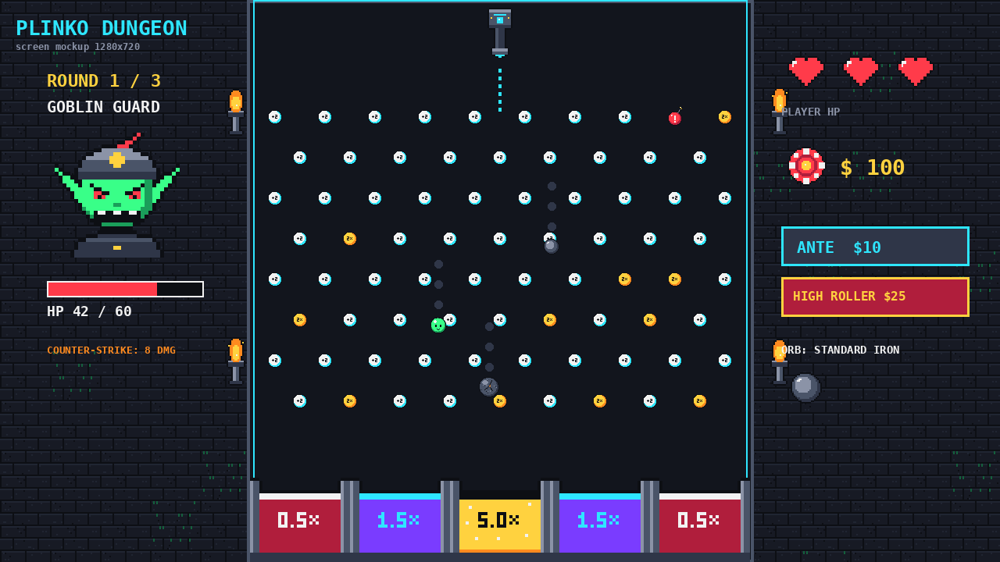

# 🎯 PLINKO DUNGEON

> **IMT01306618 Games Development | Odd Semester 2026/2027**  
> **Author:** Sean Tandjaja  
> **Engine:** GDevelop 5 (Physics 2.0 Box2D) & Standalone HTML5 Canvas  
> **Live Demo:** Open `index.html` in any web browser or deploy with GitHub Pages!



---

## 📜 Logline
A 3-minute single-player physics-pachinko dungeon duel where you drop kinetic orbs through randomized multiplier pegs to slay a boss before it counter-attacks your health to zero.

---

## 🎮 Core Game Loop
1. **Aim**: Position the dropper horizontally across the top rail (`[A]` / `[D]`, Arrow Keys, or Mouse).
2. **Wager**: Choose your ante bet before dropping:
   - `[1]` **Standard Ante ($10)**: Safe, consistent play.
   - `[2]` **High Roller ($25)**: High risk, exponential jackpot rewards!
3. **Drop**: Release your kinetic orb into the pegboard (`[SPACE]` or Left Click).
4. **Cascade**: The orb bounces off pegs with Box2D elastic physics:
   - ⚪ **Standard White Peg**: `+2 DMG`
   - 🟡 **Multiplier Gold Peg**: `2x Multiplier`
   - 🔴 **Bomb Red Peg**: `+10 AOE DMG` with explosive shockwave
5. **Score & Combat Resolution**:
   - The orb lands in one of the 5 bottom multiplier buckets: `[0.5x, 1.5x, 5.0x, 1.5x, 0.5x]`.
   - Landing in the center bucket triggers the **5.0x JACKPOT!**
   - Total Damage = `(Accumulated Peg DMG) × Multiplier × Bucket Multiplier`.
   - Chip Payout = `Wager × Bucket Multiplier`.
   - The boss takes damage. If still alive, the boss counter-attacks player HP!
6. **Drafting (Between Floors)**:
   - When Boss 1 or 2 is defeated, draft 1 of 3 reward orbs to alter your physics & combat build:
     - ⚙️ **Standard Iron**: Balanced weight and restitution, `+2 Base DMG`.
     - 🟢 **Bouncy Slime**: Hyper-elastic (`0.95` restitution) to trigger massive multi-peg combos.
     - 🪨 **Heavy Boulder**: High mass and density, crushing pegs for `+8 Base DMG`.

---

## 🏆 Win & Lose Conditions
- **Win Condition**: Defeat all 3 dungeon bosses (deplete Dragon Landlord HP to 0 across 3 consecutive rounds).
- **Lose Condition**: 
  - Player HP reaches 0 from cumulative boss counter-attacks, OR
  - Player runs out of chips (`<$10`) and cannot place the minimum ante bet.

---

## 👹 Boss Escalation
| Round | Boss | Max HP | Counter-Strike DMG |
|---|---|---|---|
| **Round 1** | **Goblin Guard** | `60 HP` | `8 DMG` |
| **Round 2** | **Slime Brute** | `120 HP` | `12 DMG` |
| **Round 3** | **Dragon Landlord** | `200 HP` | `16 DMG` |

---

## 🕹️ Controls
| Action | Key / Input |
|---|---|
| **Move Dropper Left** | `[A]` or `[Left Arrow]` |
| **Move Dropper Right** | `[D]` or `[Right Arrow]` |
| **Mouse Aim** | Hover cursor over playfield |
| **Drop Orb** | `[SPACE]` or `[Left Click]` |
| **Select Standard Ante ($10)** | `[1]` or Click Ante Button |
| **Select High Roller ($25)** | `[2]` or Click High Roller Button |
| **Toggle Audio** | Click `🔊 Sound: ON/OFF` button |
| **Restart Game** | `[SPACE]` on Game Over / Victory screen |

---

## 📁 Repository Structure
```
Plinko Dungeon/
├── index.html                   ← Standalone playable HTML5 build (Browser / GitHub Pages)
├── game.json                    ← GDevelop 5 master project definition
├── Plinko Dungeon.json          ← GDevelop 5 alternative project load file
├── screen_mockup_1280x720.png   ← 1280x720 art & layout reference
├── asset_preview.png            ← Asset preview sheet
├── README.md                    ← Game design & repository documentation
└── assets/                      ← 32x32 pixel sprites & 16-bit audio assets
    ├── boss1_goblin_guard.png
    ├── boss2_slime_brute.png
    ├── boss3_dragon_landlord.png
    ├── bucket_0_5x_a.png
    ├── bucket_1_5x_a.png
    ├── bucket_5_0x.png
    ├── bucket_1_5x_b.png
    ├── bucket_0_5x_b.png
    ├── dropper.png
    ├── orb_standard_iron.png
    ├── orb_bouncy_slime.png
    ├── orb_heavy_boulder.png
    ├── peg_standard_white.png
    ├── peg_multiplier_gold.png
    ├── peg_bomb_red.png
    ├── torch_f1.png / torch_f2.png
    ├── ui_chip.png / ui_heart.png
    ├── wall_brick.png / wall_mossy.png
    ├── bgm_chiptune.wav         ← 130 BPM 16-bit arcade battle theme
    ├── sfx_dropper_move.wav
    ├── sfx_orb_release.wav
    ├── sfx_peg_ding.wav
    ├── sfx_bomb_explosion.wav
    ├── sfx_jackpot_chime.wav
    ├── sfx_boss_hurt.wav
    └── sfx_player_hurt.wav
```

---

## 🚀 How to Run the Game

### Option 1: Standalone Web Play (Instant)
1. Double-click `index.html` in Finder / File Explorer to open in Chrome, Safari, or Edge.
2. Or serve locally with any web server:
   ```bash
   npx serve .
   # or
   python3 -m http.server 8080
   ```
3. Open `http://localhost:8080` in your browser.

### Option 2: GDevelop 5 Project
1. Open **GDevelop 5**.
2. Click **Open a project** and navigate to this folder.
3. Select `game.json` or `Plinko Dungeon.json`.
4. Click the **Preview** button (play icon) in the top toolbar to launch the Box2D physics simulation.

---

## 🎨 Art & Audio Direction
- **Sprites**: 32×32 pixel art with a 16-colour retro arcade palette (vibrant neon arcade on dark slate dungeon stone).
- **Viewport**: 1280×720 single fixed viewport with zero camera scrolling.
- **Audio**: 1 background chiptune track (130 BPM, retro casino bassline, driving percussion, synth lead) and 7 synthesized sound effects with pitch-scaled combos.
