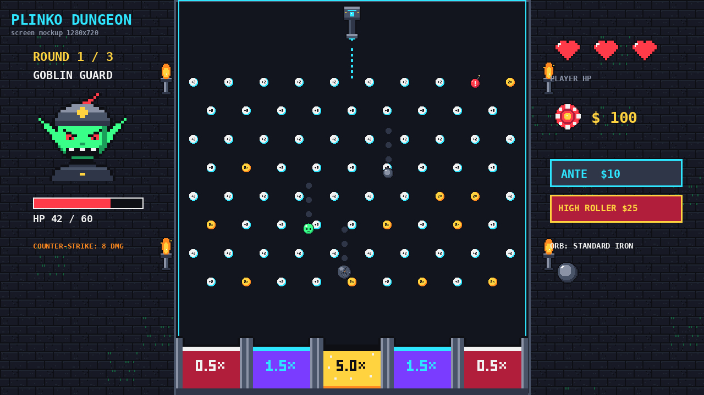

# 🎯 PLINKO DUNGEON

> **IMT01306618 Games Development | Odd Semester 2026/2027**  
> **Author:** Sean Tandjaja  
> **Engine:** GDevelop 5 (Physics 2.0 Box2D)  
> **Project Files:** `game.json` (Standard GDevelop) & `Plinko Dungeon.json`



---

## 📜 Logline
A roguelike physics-pachinko descent. Drop orbs through pegs to damage monsters, choose your path across procedurally generated dungeon maps, and see how deep one run can go.

---

## 🎮 Core Loop
1. **Map**: Each act is a fresh branching map (battles, elites, rest sites, shops, treasure, and a boss). Pick a glowing room to enter it.
2. **Battle**: A random enemy (scaled by act and depth) on a procedurally generated peg board (classic, scatter, diamond, caverns or lanes layouts).
3. **Wager & Drop**: Choose `[1]` Ante ($10) or `[2]` High Roller ($25, damage x1.5), aim with `[A]/[D]` or the mouse, drop with `[SPACE]` or click. Your next orb comes from your shuffled orb bag (see Orbs).
4. **Cascade**: Each peg scores once per shot.
   - ⚪ **White peg**: + the orb's damage per peg.
   - 🟡 **Gold peg**: +0.5x multiplier.
   - 🔴 **Bomb peg**: +6 damage, then the blast **destroys the orb**. The shot ends right there at a flat 1x (no bucket).
5. **Bucket**: `[0.5x, 1.5x, 5.0x, 1.5x, 0.5x]`. Damage = `pegs × multiplier × bucket (× 1.5 high roller) − armor`. Chips won = `wager × bucket`.
6. **Enemy turn**: If the enemy survives it attacks, and may regenerate, enrage, steal chips or tax you.
7. **Rewards**: Battles give a new orb or an orb upgrade, elites and treasure give relics, and the boss gives a relic, a heal and the next act. The run never ends until you die.

---

## 🔮 Orbs
| Orb | Base | Per Peg | Bounce | Notes |
|---|---|---|---|---|
| Standard Iron | 1 | +1 | 0.55 | Balanced and predictable |
| Bouncy Slime | 0 | +1 | 0.82 | Long cascades |
| Heavy Boulder | 5 | +1 | 0.20 | Falls fast and smashes white pegs |

You start with **one Standard Iron**. Orbs you win join your **orb bag**. Every drop uses the next orb in the bag, and the bag reshuffles when it runs out. The right panel shows the next orb and the queue behind it (between fights it shows the whole bag). Upgrades name the exact orb they improve: +1 base and +1 per peg.

## 💎 Relics (15)
Lucky Clover, Loaded Dice, Whetstone, Gold Tooth, Powder Keg, Iron Skin, Vampire Fang, Heart Container, Piggy Bank, Rubber Pegs, Lead Lining, Phoenix Feather, Jackpot Magnet, Bomb Bag, Gold Leaf.

## 👹 Enemies
- **Normal**: Goblin Grunt, Goblin Archer, Cave Slime, Gold Grubber, Ember Slime, Ironclad Goblin, Bone Wyrmling, Toxic Slime
- **Elite**: Goblin Warlord, Slime Brute, Drake Sentinel
- **Bosses**: Goblin King (Act 1), King Slime (Act 2), Dragon Landlord (Act 3). These repeat as "Elder" bosses in endless acts.

HP and attack scale with act and map depth.

---

## 🕹️ Controls
| Action | Key / Input |
|---|---|
| Aim | `[A]` / `[D]`, arrow keys, or mouse |
| Drop orb | `[SPACE]`, `[DOWN]`, or click the playfield |
| Ante $10 / High Roller $25 | `[1]` / `[2]` or click the buttons |
| Map: choose room | Click, or `[LEFT]`/`[RIGHT]` + `[SPACE]` |
| Cards: pick / skip | Click or `[1]` `[2]` `[3]` / `[S]` |
| Mute | `[M]` |

## 🏆 Win & Lose
The run is endless, so your score is how deep you got. You lose when your HP hits 0 (Phoenix Feather saves you once). With fewer than $10 in chips you still drop for free, but earn no chips. Your best run is saved in the browser.

---

## 🖥️ Screen Size
The project uses the `scaleOuter` resize mode. The full 1280x720 layout is always visible, and any spare space on wide or tall windows shows dungeon wall instead of black bars.

## 🧩 Code Layout
Aiming and visual cleanup are visual events. The roguelike systems are **JavaScript code events** in the `Game` scene, each with a title comment: data tables, procedural map, board generator, run state, card screens, map screen, battle and physics, payout and enemy turn, title and game over, HUD, and the main loop. All balance numbers live in the first "Data" event.

---

## 📁 Repository Structure
```
Plinko Dungeon/
├── game.json                    ← GDevelop 5 canonical project definition (opens directly across platforms)
├── Plinko Dungeon.json          ← GDevelop 5 alternate project file (synchronized 1:1)
├── screen_mockup_1280x720.png   ← 1280x720 art & layout reference
├── asset_preview.png            ← Asset preview sheet
├── .gitattributes               ← Preserves binary integrity for PNG/WAV across OSes
├── README.md                    ← Game design & repository documentation
└── assets/                      ← 32x32 pixel sprites & 16-bit audio assets (57 total)
    ├── card_draft_*.png / ui_draft_header.png  ← legacy art, no longer used in the scene
    ├── ui_banner_frame.png
    ├── ui_btn_ante.png / ui_btn_highroller.png / ui_aim_dots.png
    ├── ui_hp_frame.png / ui_hp_fill.png / ui_neon_horiz.png / ui_neon_vert.png
    ├── ui_chip.png / ui_heart.png
    ├── boss1_goblin_guard.png / boss2_slime_brute.png / boss3_dragon_landlord.png
    ├── bucket_0_5x_a.png / bucket_1_5x_a.png / bucket_5_0x.png / bucket_1_5x_b.png / bucket_0_5x_b.png
    ├── dropper.png
    ├── orb_standard_iron.png / orb_bouncy_slime.png / orb_heavy_boulder.png
    ├── peg_standard_white.png / peg_standard_white_hit.png
    ├── peg_multiplier_gold.png / peg_multiplier_gold_hit.png
    ├── peg_bomb_red.png / peg_bomb_red_hit.png
    ├── fx_spark_cyan_f1..f4.png / fx_spark_gold_f1..f4.png / fx_spark_bomb_f1..f5.png
    ├── torch_f1.png / torch_f2.png
    ├── wall_brick.png / wall_mossy.png
    ├── bgm_chiptune.wav         ← 130 BPM 16-bit arcade battle theme
    └── 7 Synthesized SFX (.wav)
```

---

## 🚀 How to Run in GDevelop 5
1. Open **GDevelop 5**.
2. Click **Open a project** (or browse to the folder).
3. Select `game.json` (or `Plinko Dungeon.json`).
4. Click the **Preview** button (play icon) in the top toolbar.

### ⚠️ Collaborator Git Pull Guide (If Assets Don't Load)
If collaborators pulled previously and encounter missing assets or red placeholders, it is usually caused by an outdated local working copy or Git blocking a pull due to local autosaves:
```bash
# 1. Reset any local autosaves or uncommitted scene changes
git reset --hard origin/main

# 2. Pull the latest assets and project files
git pull origin main

# 3. Open game.json or Plinko Dungeon.json directly in GDevelop
```
# Plinko-Dungeon
